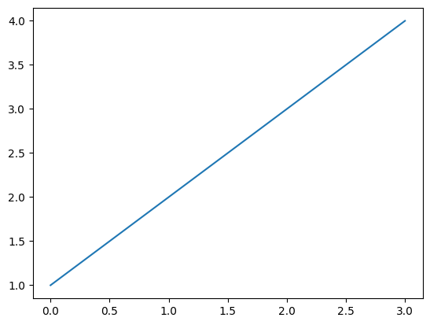
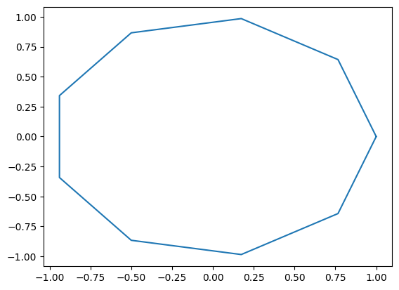
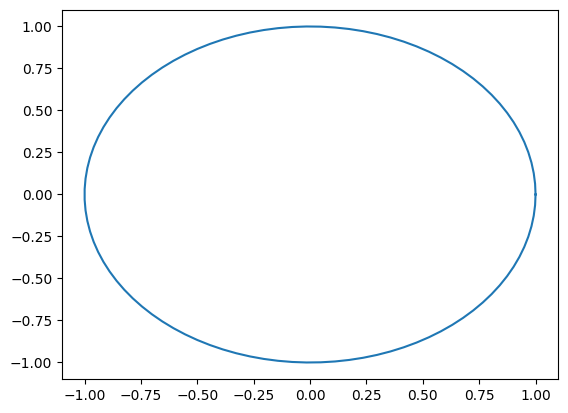
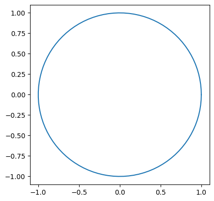
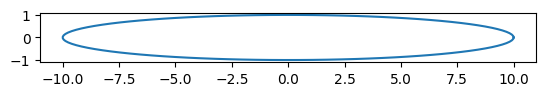

## What We Need
- numpy, how we did our circle cordianates before,
- a draw scheme, matplot lib is all the rage


We'll source our venv command in terminal, then pip install matplotlib according to [Matplotlib](https://matplotlib.org/stable/users/getting_started/)

``` zsh
pip3 install matplotlib

```

it installed

## Simplifying before we draw

according to circlelist we can get our values, but lets make them functions to be able to reuse them without all the copy and paste


```python
import numpy as np
import matplotlib.pyplot as plt
```


```python
x = [1,2,3,4,5]
y = [4,3,2,1]
```


```python

def circle_with_resolution(x):
    degrees = []

    for i in range(0,x):
        degrees.append(i)
    


    klist = []
    
    for i in range(0,len(degrees)):
        k = 2*np.pi*degrees[i] / max(degrees)
        klist.append(k)
    
    
    
    xlist = []
    
    for i in range(0, len(klist)):
        x = np.cos(klist[i])
        xlist.append(x)
    
    native_xlist = []
    for i in range(0,len(xlist)):
        j = xlist[i].item()
        native_xlist.append(j)
    
    
    ylist = []
    
    for i in range(0, len(klist)):
        y = np.sin(klist[i])
        ylist.append(y)
    
    native_ylist = []
    for i in range(0,len(ylist)):
        j = ylist[i].item()
        native_ylist.append(j)

    return [native_xlist, native_ylist]
    

    

```


```python
circle_with_resolution(10)
```


    [[1.0,
      0.766044443118978,
      0.17364817766693041,
      -0.4999999999999998,
      -0.9396926207859083,
      -0.9396926207859084,
      -0.5000000000000004,
      0.17364817766692997,
      0.7660444431189779,
      1.0],
     [0.0,
      0.6427876096865393,
      0.984807753012208,
      0.8660254037844388,
      0.3420201433256689,
      -0.34202014332566866,
      -0.8660254037844384,
      -0.9848077530122081,
      -0.6427876096865396,
      -2.4492935982947064e-16]]


```python
set = circle_with_resolution(10)
```

## Now lets try ploting something with matplotlib
refer to https://matplotlib.org/stable/tutorials/pyplot.html#sphx-glr-tutorials-pyplot-py


```python
plt.plot([1,2,3,4])
plt.show()
```


    

    


Great, that worked swell, lets try a circle, if it even can


```python
plt.plot(set[0], set[1])
```


    [<matplotlib.lines.Line2D at 0x117420f50>]


    

    


Amazing, what a beautiful circle, lets add more points


```python
plt.plot(circle_with_resolution(100)[0], circle_with_resolution(100)[1])
```


    [<matplotlib.lines.Line2D at 0x1174b2490>]


    

    


It's smooth now, but it doesnt look like a circle, more squashed, lets adjust the axis to be 1 to 1 if we can.


We'll try gca (get current axis) and see if we can change that. Thanks for the [question](https://stackoverflow.com/questions/17990845/how-do-i-equalize-the-scales-of-the-x-axis-and-y-axis)


```python
plt.plot(circle_with_resolution(100)[0], circle_with_resolution(100)[1])

ax = plt.gca()
ax.set_aspect("equal") #https://matplotlib.org/stable/api/_as_gen/matplotlib.axes.Axes.set_aspect.html#matplotlib.axes.Axes.set_aspect
plt.draw()


```


    

    


## Perfect, that looks like a circle if I squint

lets see if we stretch it to an oval


```python
xlist = circle_with_resolution(100)[0]
longx = []
for i in range(0,len(xlist)):
    k = xlist[i]*10
    longx.append(k)
    


plt.plot(longx, circle_with_resolution(100)[1])

ax = plt.gca()
ax.set_aspect("equal") #https://matplotlib.org/stable/api/_as_gen/matplotlib.axes.Axes.set_aspect.html#matplotlib.axes.Axes.set_aspect
plt.draw()
```


    

    


Great, we have an oval, preditable and likable.


```python

```
