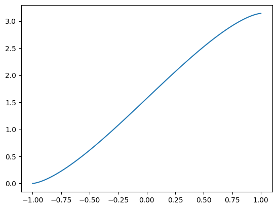

## Falling through the Earth
I recently saw a challenge to calculate the time it would take to fall through the earth and if you would end up on the other side of earth, assuming a straight hole through.

## What we need, or think we need

- the formula for gravitational force between two bodies
$$ G \frac{m_1*m_2}{r^2}    $$
- Radius of the earth = 6378137.0 m
- Gravitational Constant $$ 6.67430*10^−11 \ N*m^2*kg^-2$$


Since we know that surface level graviational acceleration is ~9.8m/s^2 lets try to back calculate the mass of the earth assuming our person is of negliable mass for the graviational force.

$$ \lim_{m_2\to1kg} G \frac{m_1*m_2}{r^2} = 9.8 \ kg*m/s^2 $$

$$ G* \frac{m_1*1kg}{r^2} = 9.8 \ kg*m/s^2   $$
Plug in the radius of the earth (assuming the center of the earth is the center of mass)

$$ G* \frac{m_1*1kg}{{6378137^2}m^2} = 9.8 \ kg*m/s^2   $$

And plug in G

$$  6.67430*10^{−11} \ kg*m*s^{-2}m^2kg^{-2} * \frac{m_1*1kg}{{6378137^2}m^2} = 9.8 \ kg*m/s^2   $$

Lets Cancel so units to make it more readable

$$  6.67430*10^−11 \ kg*m*s^{-2}m^2kg^{-2} * \frac{m_1*1kg}{{6378137^2}m^2} = 9.8 \ kg*m/s^2   $$

$$  6.67430*10^{-11} \ \cancel{kg}*m*s^{-2}\cancel{m^2}\cancel{kg^{-2}} * \frac{m_1*1\cancel{kg}}{{6378137^2}\cancel{m^2}} = 9.8 \ kg*m/s^2   $$

Now let's plug solve for $$m_1$$

$$ m_1 = \frac{9.8 \ kg*m/s^2 *6378137^2}{6.67430*10^{-11}m*s^{-2}} $$


```python
m_1 = 9.8*(6378137**2)/(6.67430*10**(-11))
print(m_1 ,"kg")
```

    5.973213514369092e+24 kg


## Assumptions
Lets assume that the earth is homogenous in mass, and is a perfect sphere where our hole goes through the origin.

Now when we fall the there will be mass above us, so how will that affect acceleration.

Let's say that 

$$ F_{total} = F_{below}-F_{above}$$

The formula for Area of a circle is:

(derived it when trying to find the area of a circle for a math problem, got a completely different answer from the committee but this still works for all cases I've seen, and I like it because it gives a contiunous function) where a is the radius of the circle


$$a^{2}\left(\sin^{-1}\left(\frac{x}{a}\right)+\frac{1}{2}\sin\left(2\sin^{-1}\left(\frac{x}{a}\right)\right)\right)+a^{2}\left(\frac{\pi}{2}\right) $$


```python
import numpy as np
import matplotlib.pyplot as plt
```


```python
a = 1
x = []
for i in range(0,101):
    k = ((2*a)*i/100)-(a)
    x.append(k)

y = []
for i in range(0,len(x)):
    j = (a**2)*(np.arcsin(x[i]/a)+0.5*np.sin(2*np.arcsin(x[i]/a)))+(a**2)*(np.pi/2)
    y.append(j)
print(y)
```

    [np.float64(0.0), np.float64(0.0053173046502219545), np.float64(0.014994109208327888), np.float64(0.02746204561939969), np.float64(0.04215095144297765), np.float64(0.05872590687760182), np.float64(0.07695728487716069), np.float64(0.09667378603163401), np.float64(0.11774052955707859), np.float64(0.14004722093365762), np.float64(0.16350110879328428), np.float64(0.18802248872920657), np.float64(0.21354167677747649), np.float64(0.23999688551756182), np.float64(0.2673326825624194), np.float64(0.29549884018614403), np.float64(0.32444945652378054), np.float64(0.35414227069059323), np.float64(0.38453811973349783), np.float64(0.4156005014933857), np.float64(0.4472952180016123), np.float64(0.47959008110018697), np.float64(0.5124546668243757), np.float64(0.545860108484957), np.float64(0.5797789208144499), np.float64(0.6141848493043784), np.float64(0.6490527401606513), np.float64(0.6843584272761589), np.float64(0.7200786333557452), np.float64(0.7561908828925195), np.float64(0.7926734251309413), np.float64(0.8295051654932818), np.float64(0.8666656042151673), np.float64(0.904134781149897), np.float64(0.941893225872695), np.float64(0.9799219123544154), np.float64(1.0182022175865686), np.float64(1.0567158836313029), np.float64(1.0954449826453108), np.float64(1.1343718844887754), np.float64(1.1734792265819116), np.float64(1.2127498857143943), np.float64(1.2521669515485467), np.float64(1.2917137015867912), np.float64(1.3313735773985962), np.float64(1.3711301619226748), np.float64(1.410967157677224), np.float64(1.4508683657249728), np.float64(1.4908176652511578), np.float64(1.530798993621586), np.float64(1.5707963267948966), np.float64(1.6107936599682071), np.float64(1.6507749883386353), np.float64(1.6907242878648203), np.float64(1.730625495912569), np.float64(1.7704624916671186), np.float64(1.810219076191197), np.float64(1.8498789520030017), np.float64(1.8894257020412462), np.float64(1.9288427678753983), np.float64(1.9681134270078815), np.float64(2.0072207691010178), np.float64(2.0461476709444826), np.float64(2.0848767699584903), np.float64(2.1233904360032243), np.float64(2.161670741235378), np.float64(2.1996994277170985), np.float64(2.2374578724398964), np.float64(2.274927049374626), np.float64(2.312087488096511), np.float64(2.3489192284588514), np.float64(2.3854017706972734), np.float64(2.421514020234048), np.float64(2.457234226313634), np.float64(2.492539913429142), np.float64(2.5274078042854144), np.float64(2.5618137327753434), np.float64(2.595732545104836), np.float64(2.6291379867654174), np.float64(2.662002572489606), np.float64(2.6942974355881812), np.float64(2.7259921520964077), np.float64(2.7570545338562953), np.float64(2.7874503828992), np.float64(2.8171431970660126), np.float64(2.846093813403649), np.float64(2.8742599710273735), np.float64(2.901595768072231), np.float64(2.9280509768123166), np.float64(2.9535701648605865), np.float64(2.978091544796509), np.float64(3.0015454326561355), np.float64(3.0238521240327145), np.float64(3.044918867558159), np.float64(3.064635368712632), np.float64(3.0828667467121913), np.float64(3.0994417021468155), np.float64(3.1141306079703934), np.float64(3.1265985443814652), np.float64(3.136275348939571), np.float64(3.141592653589793)]


```python
plt.plot(x,y)
```


    [<matplotlib.lines.Line2D at 0x10bc38410>]


    

    


How to find the center of mass as we fall,

the center of mass as we fall is the max area of the circle minus the area we are at divided by 2. We then have the mass value for the new center and we back calculate to get the radius.


$$ A(center\ of\ area) = \frac{A_{max} - A(r)}{2}$$

Lets isolate our radius from our equation so we can solve for it given an area:

$$a^{2}\left(\sin^{-1}\left(\frac{x}{a}\right)+\frac{1}{2}\sin\left(2\sin^{-1}\left(\frac{x}{a}\right)\right)\right)+a^{2}\left(\frac{\pi}{2}\right) = Area$$

We'll I can't figure it out, maybe later I can introduce some constraints to make it viable to solve for radius from area. 

For now lets just try it numerically.


```python
def area_of_earth_below(radius,a):
  
    amax = (a**2)*(np.arcsin(a/a)+0.5*np.sin(2*np.arcsin(a/a)))+(a**2)*(np.pi/2)

    
    ar = (a**2)*(np.arcsin(radius/a)+0.5*np.sin(2*np.arcsin(radius/a)))+(a**2)*(np.pi/2)

    a_center = (amax+ar)/2

    return a_center, amax, ar
```


```python
area_of_earth_below(0.5,a)
```


    (np.float64(2.834500228937604),
     np.float64(3.141592653589793),
     np.float64(2.5274078042854144))


```python
def radius_solver(x,y,radius,a):

    d = list(map(lambda y: abs(y-area_of_earth_below(radius,a)[0]), y))
    dmin = min(d)
    inden = 0

    for i in range(0,len(d)):
        if d[i] == dmin : inden = i

    


            
    return x[inden]
```


```python
radius_solver(x,y,0.5,a)
```


    0.7


Now we have a way to solve the center of mass, and how far away it is. Thus we can solve for gravitational force with our mass, the mass of the earth, ther graviational constant, and a changing radius, mass of earth also changes.

Lets say the earth is 2 dimensional and use 2 [dimensional mass](https://en.wikipedia.org/wiki/Area_density) area to be proportional to mass as per area density. (by the way, totally made this up and looked it up to provide a valid backing, glad others take short cuts too and its practically useful).

It is also worth note that there is a gradient of mass when taking the center of mass, as such values for $$ \frac{m_1}{r^2} $$ would have a changing value of mass per radius but let's assume that the difference is neglibile (though its probably not).

We can take the mass of the earth below and above by normalizing our domain to 0-mass of earth, so we'll divide by a max, and then multiply by mass of earth

$$ mass \ below = \frac{a_{below}*m_1}{a_{max}} $$

## Iterative approach
Graviational force interatively is 

$$        \sum_{s=0}^{200} G \frac{m(s)_1*m_2}{r(s)^2}     $$

Since we can calculate the graviational force on our object can know the velocity at time t, $$ v = \sum_{s=0}^{200} accelerration_s * 1 s $$

We know that distance traveled (our falling distance) is 

$$ d = \sum_{s=0}^{200} v * 1s $$

## Defining our system
- the formula for gravitational force between two bodies
$$ G \frac{m_1*m_2}{r^2}    $$
- Radius of the earth = $$6378137.0 m$$
- Gravitational Constant $$ 6.67430*10^−11 \ N*m^2*kg^-2$$
- mass of earth $$5.973213514369092e+24 kg$$
- mass of us $$ 1 kg$$
- intial velocity is 0, say a spontaneous sink hole


```python
earth_radius = 6378137
a = earth_radius
x = []
for i in range(0,101):
    k = ((2*a)*i/100)-(a)
    x.append(k)

y = []
for i in range(0,len(x)):
    j = (a**2)*(np.arcsin(x[i]/a)+0.5*np.sin(2*np.arcsin(x[i]/a)))+(a**2)*(np.pi/2)
    y.append(j)
    
grav_cons = 6.67430*(10**(-11))
earth_mass = 9.8*(6378137**2)/(6.67430*10**(-11))
us_mass = 1

```


```python
velocity = [0]
distance = [-6378137]
gravity_force = [9.8]

for i in range(0,10000):
    velocity_i = velocity[i]+gravity_force[i]
    distance_i = distance[i]+velocity_i

    gravity_force_i = grav_cons*((area_of_earth_below(distance_i,earth_radius)[i])/((radius_solver(x,y,distance[i],6378137)-earth_radius)**2))

    print(velocity_i, distance_i,gravity_force_i)

```

    9.8 -6378127.2 1.048396593591189e-10


    ---------------------------------------------------------------------------

    IndexError                                Traceback (most recent call last)

    Cell In[67], line 6
          3 gravity_force = [9.8]
          5 for i in range(0,10000):
    ----> 6     velocity_i = velocity[i]+gravity_force[i]
          7     distance_i = distance[i]+velocity_i
          9     gravity_force_i = grav_cons*((area_of_earth_below(distance_i,earth_radius)[i])/((radius_solver(x,y,distance[i],6378137)-earth_radius)**2))


    IndexError: list index out of range


```python
grav_cons*((area_of_earth_below(distance_i,earth_radius)[0])/((radius_solver(x,y,distance[0],6378137)-earth_radius)**2))
```


    np.float64(1.048396593591189e-10)


```python
print(radius_solver(x,y,distance[0],6378137))
```

    0.0


```python
(area_of_earth_below(distance_i,earth_radius)[0])
```


    np.float64(63900986747524.59)


```python
o = ((radius_solver(x,y,distance[0],6378137))-earth_radius)**2
print(o)
```

    40680631590769.0


```python
p= (grav_cons*earth_mass)
```


```python
print(p/o)
```

    9.8


```python
print(area_of_earth_below(0,earth_radius)[0]*earth_mass/area_of_earth_below(0,earth_radius)[1])


```

    4.479910135776819e+24


Like how we did a numerical approach for the center of mass, lets also do one for time in seconds.


```python
x_approx_time = []

for i in range(0,1000000):
    x_approx_time.append(i)


```


```python
k = (1*6378137)/200
k
```


    31890.685


```python

```


```python

```
