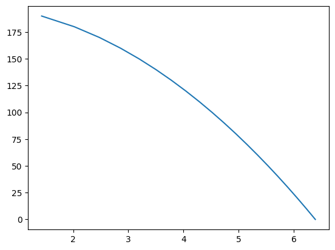
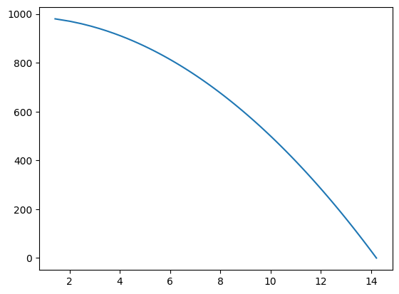
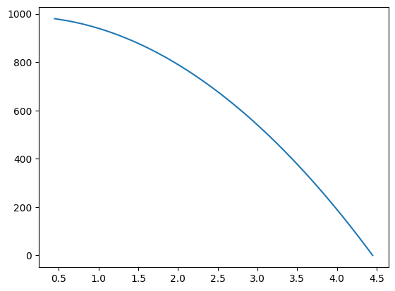
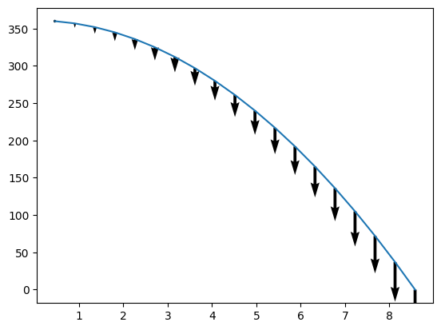

## Falling man Graph

Lets make a graph of a man falling to see how much harder it is compared to a circle, I mean, how hard could it be. Also imma try to use the lambda function because I just learned about it.


```python
import numpy as np
import matplotlib.pyplot as plt
```

### Making the equations for a falling man


```python
falling_time = lambda distance, gravity : ((2*distance)/(gravity))**(1/2)

def velocity_of_fall(distance, gravity):

    velocity = distance/falling_time(distance, gravity)

    return velocity, "m/s"


    
```


```python
velocity_of_fall(200,9.8)
```


    (31.304951684997054, 'm/s')


### Lets see if we can input an array, so that we can get a resolution of measurements in time


```python
dist = []

for i in range(0,10):
    k = i*20+20
    dist.append(k)

print(dist)
```

    [20, 40, 60, 80, 100, 120, 140, 160, 180, 200]


```python
appy = map( lambda x : x**2 , dist)
```

### Making the function take a list


```python
x = dist
z = dist
print(x)
y = 2
```

    [20, 40, 60, 80, 100, 120, 140, 160, 180, 200]


```python

list(map(lambda x : x**y, x))

```


    [400, 1600, 3600, 6400, 10000, 14400, 19600, 25600, 32400, 40000]


```python
distance = x
gravity = 9.8
time_to_fall = list(map(lambda distance : ((2*distance)/(gravity))**(1/2), distance))
velocity = list(map(lambda distance, time_to_fall: distance/time_to_fall, distance, time_to_fall))
```


```python
print(velocity)
print(time_to_fall)
```

    [9.899494936611665, 14.0, 17.146428199482248, 19.79898987322333, 22.135943621178654, 24.24871130596428, 26.19160170741759, 28.0, 29.698484809834998, 31.304951684997054]
    [2.0203050891044216, 2.857142857142857, 3.499271061118826, 4.040610178208843, 4.5175395145262565, 4.948716593053935, 5.3452248382484875, 5.714285714285714, 6.0609152673132645, 6.388765649999399]


Now we have a way to apply functions to a list


```python
gravity = 9.8

list(map(lambda distance : ((2*distance)/(gravity))**(1/2), distance))
def velocity_of_fall(distance, gravity):
    time_to_fall = list(map(lambda distance : ((2*distance)/(gravity))**(1/2), distance))
    velocity = list(map(lambda distance, time_to_fall: distance/time_to_fall, distance, time_to_fall))

    return velocity

```


```python
velocity_of_fall([1,1000], 9.8)
```


    [2.2135943621178655, 70.0]


Let's make the time to fall a defined function as well


```python
time_to_fall = list(map(lambda distance : ((2*distance)/(gravity))**(1/2), distance))
def fall_time(distance, gravity):
    time_to_fall = list(map(lambda distance : ((2*distance)/(gravity))**(1/2), distance))
    return time_to_fall
```


```python
fall_time(x, 9.8)
```


    [2.0203050891044216,
     2.857142857142857,
     3.499271061118826,
     4.040610178208843,
     4.5175395145262565,
     4.948716593053935,
     5.3452248382484875,
     5.714285714285714,
     6.0609152673132645,
     6.388765649999399]


## Its Graphing Time

Well now that we know how far we fall, how long we fall, and how fast we are falling lets make some graphs, as per the goal

Let's try a simple plot of time versus distance, a graph of a person falling as we progress forward in time.


```python
distance = [] 

for i in range(1,21):
    distance.append(i*10)

print(distance)
```

    [10, 20, 30, 40, 50, 60, 70, 80, 90, 100, 110, 120, 130, 140, 150, 160, 170, 180, 190, 200]


```python
plt.plot(fall_time(distance, 9.8), [-x+max(distance) for x in distance])
plt.show()
```


    

    


It looks a bit like feather fall from bg3, so lets graph it out for longer.


```python
distance = [] 

for i in range(1,100):
    distance.append(i*10)

print(distance)
```

    [10, 20, 30, 40, 50, 60, 70, 80, 90, 100, 110, 120, 130, 140, 150, 160, 170, 180, 190, 200, 210, 220, 230, 240, 250, 260, 270, 280, 290, 300, 310, 320, 330, 340, 350, 360, 370, 380, 390, 400, 410, 420, 430, 440, 450, 460, 470, 480, 490, 500, 510, 520, 530, 540, 550, 560, 570, 580, 590, 600, 610, 620, 630, 640, 650, 660, 670, 680, 690, 700, 710, 720, 730, 740, 750, 760, 770, 780, 790, 800, 810, 820, 830, 840, 850, 860, 870, 880, 890, 900, 910, 920, 930, 940, 950, 960, 970, 980, 990]


```python
plt.plot(fall_time(distance, 9.8), [-x+max(distance) for x in distance])
plt.show()
```


    

    


There seems to be a bit more of a curve but lets modulate gravity to see if that makes the curve steeper. Say 10x gravity for sayian training


```python
plt.plot(fall_time(distance, 100), [-x+max(distance) for x in distance])
plt.show()
```


    

    


That does shorten the fall time no linear, hope goku trains reaction time as well as strength.

### Let's Try Plotting velocity arrows so we can see how fast someone is falling at a given time?

https://matplotlib.org/stable/plot_types/arrays/quiver.html#sphx-glr-plot-types-arrays-quiver-py


```python
distance = [] 

for i in range(1,20):
    distance.append(i)

distance = list(map( lambda x: x**2, distance))
print(distance)
```

    [1, 4, 9, 16, 25, 36, 49, 64, 81, 100, 121, 144, 169, 196, 225, 256, 289, 324, 361]


```python
fig, ax = plt.subplots()
X = fall_time(distance, 9.8)
Y = [-x+max(distance) for x in distance]
U = 0
V = [-x for x in velocity_of_fall(distance, 9.8)]
ax.quiver(X,Y,U,V)
ax.plot(X,Y)
```


    [<matplotlib.lines.Line2D at 0x116842c10>]


    

    


We can see that velocity increase the longer we fall, and that's pretty dope we can have two graphs on the same plot with arrows. Our power only grows from here. 


```python

```
